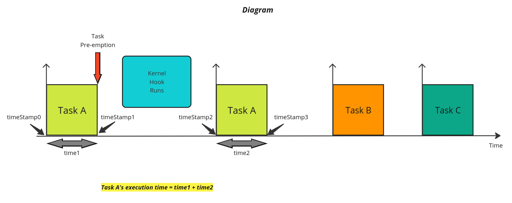



<h2> Measuring Real-Time Tasks Execution Times in VxWorks </h2>

Kernel module written in the C programming language that utilizes kernel-level functions to measure the execution times of pre-emptive real-time tasks. 
[GitHub](https://github.com/axel-ra/Real-Time-Execution-Times-using-VxWorks.git){:target="_blank"}\
